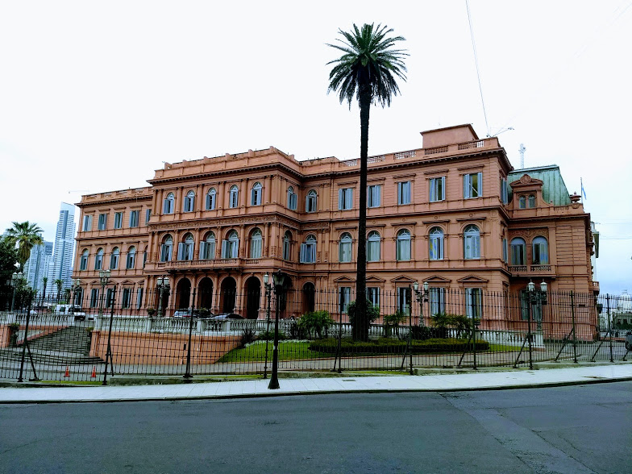
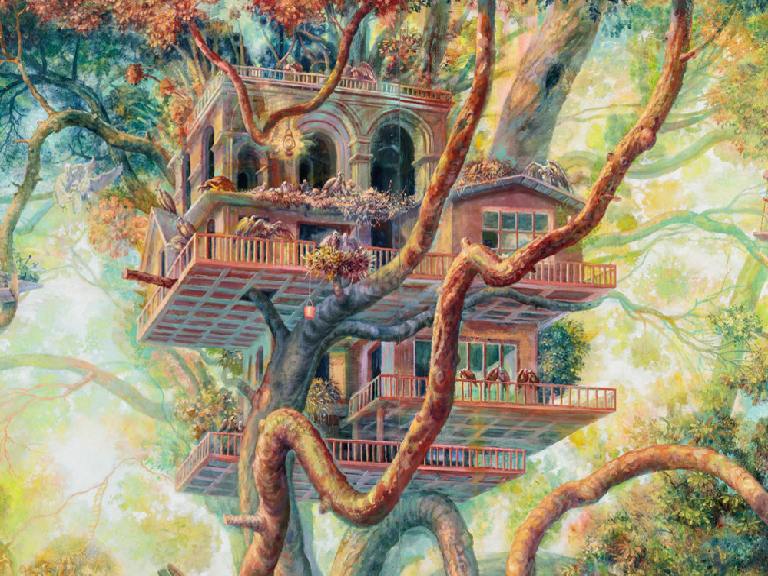
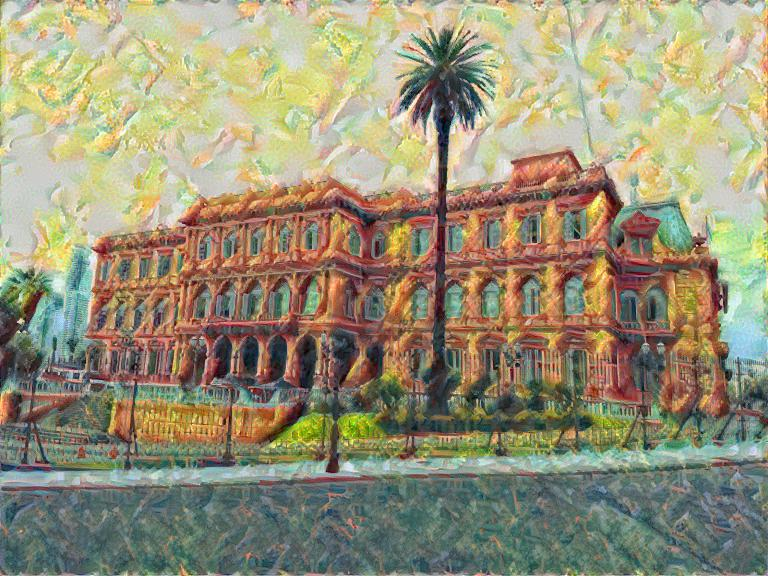
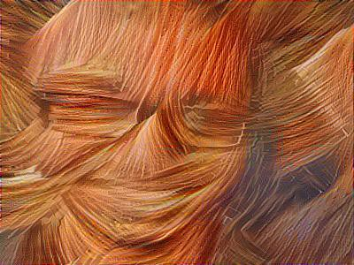
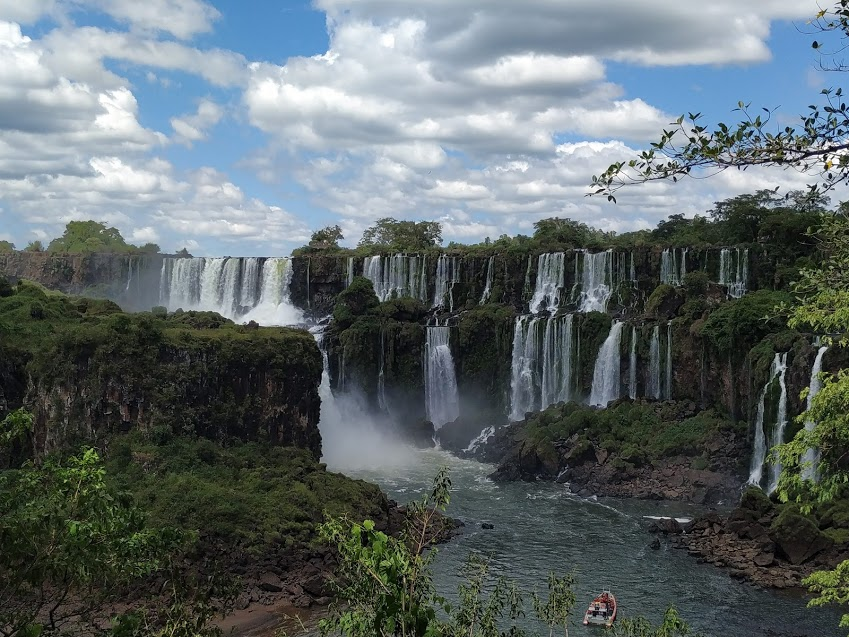
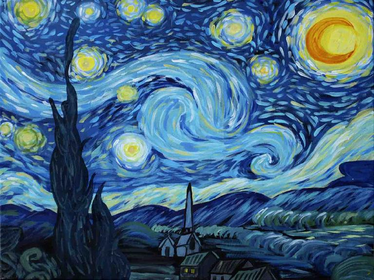
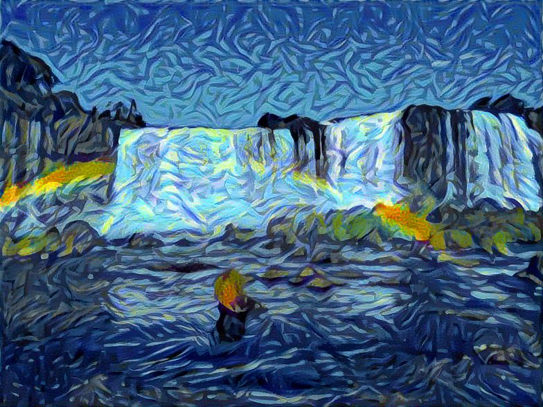
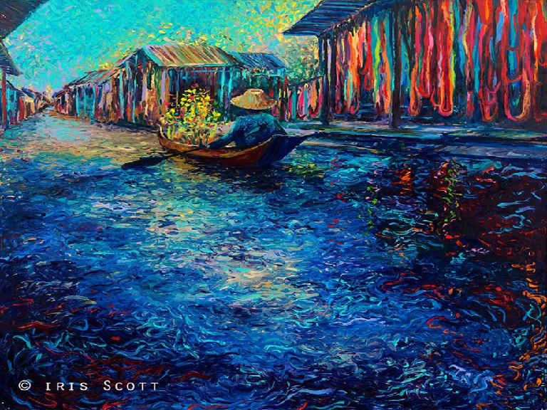

### Art Creation With Neural Style Transfer

<<<<<<< HEAD
Neural style transfer consist of transferring the style of one image  to another through the use of Deep Neural Networks. We
a content image (image we are going to transfer the style to) and the style image (image from which we get the style) to generate the
output image, which is the very same content image with the distinctive characteristics of the style image.

For this particular implementation we use Tensorflow framework and the VGG-19 pre-trained model. This project is based on the Programming Assignment
of the Coursera's [Convolutional Neural Networks](https://www.coursera.org/learn/convolutional-neural-networks/home/welcome) course, but  with
some added features for better understanding (I hope) and better results on the output image. Among those features is the possibility of using more 
than one style image as we are going to see below.

The notebook is very self-explanatory so we are going to jump right to the results we obtained:

|content||style||output|
|:---:|:---:|:---:|:---:|:---:|
||+|| = ||
||+|| = ||
||+|| = ||
||+|| = ||
